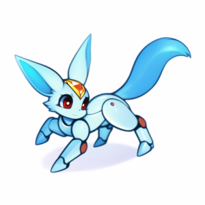

# Mecha Carbuncle
Discord bot designed for managing FFXIV raids and other schedules

# Commands

## **/poll**
Create a new poll

#### **Arguments**:
> **title**: What is the poll about?

> **options**: Number of options to select from in the poll. Defaults to 2 options, with a max of 5.

> **multiselect**: Whether or not multiple poll options can be selected at the same time.

> **role**: Lock replies to a chosen role, and ping it

> **time_limit**: Set a time limit on the poll (in minutes)

> **max_votes**: Stop the poll at a certain number of votes.

> **show_users**: Show who has voted for a poll. Displays a max of 20 users for each option.

> **hide_results**: Hide votes until the vote has ended, or only show the results to the polls creator in a DM.

