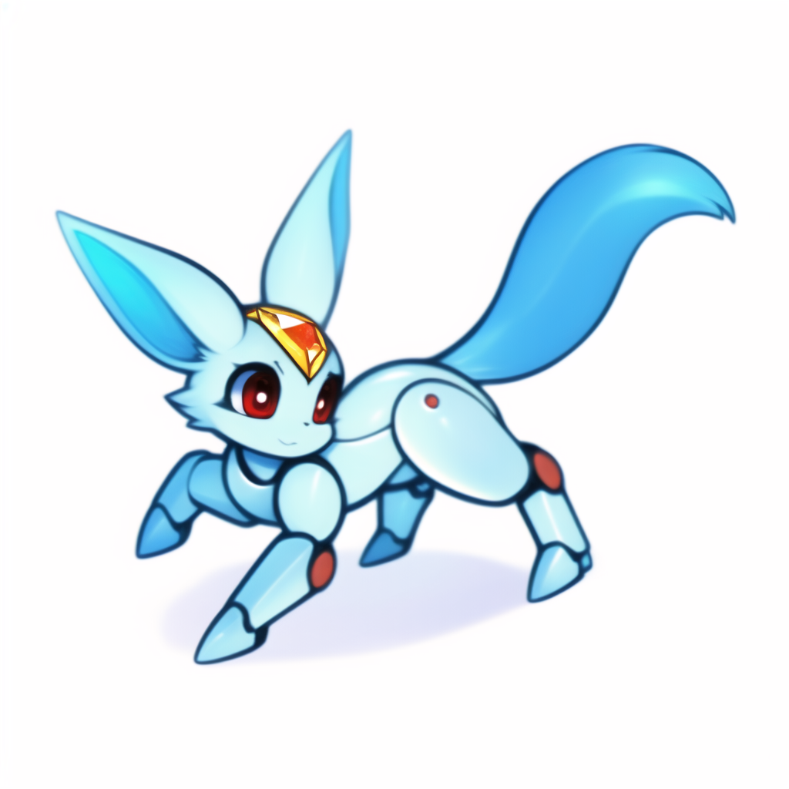

# Mecha Carbuncle
Discord bot designed for managing FFXIV raids and other schedules

# Commands

## **/schedule**
Command to manage schedules

### /schedule **new**
Creates a new schedule

#### **Arguments**:
> **times**: The days and times this event happens. Required

> **name**: The name of the schedule. Defaults to 'Raid'.

> **repeats**: Whether or not this shedule should repeat weekly. Defaults to False.

> **default**: Whether or not this is the default schedule to select with other commands, should you have multiple schedules.
defaults to True for the first schedule created.

### /schedule **remove**
Delete a schedule

#### **Arguments**:
> **name**: name of the schedule to delete.

### /schedule **edit**
Edits a schedule with a given name. Same arguments as **new**, except **name** is optional, plus
> **rename**: the new name of the schedule

### /schedule **list**
List all schedules

### /schedule **view**
View a specific schedule in detail

#### **Arguments**:
> **name**: name of the schedule to view. Optional, uses the default schedule if no name is provided

### /schedule **move**
Move an event from one day/time to another, either temporarily or permanantly

#### **Arguments**:
> **name**: name of the schedule to move. Optional, uses the default schedule if no name is provided

## **/poll**
Create a new poll
